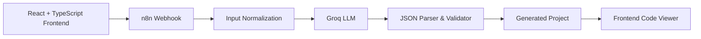

# AppPilot

**One-day AI prototype for generating React applications from natural-language prompts**

[Русская версия / Russian documentation](README.ru.md)

AppPilot is an AI application generator built as a **rapid prototype during a one-day competition**.

A user describes an application in natural language, and AppPilot sends the request through an n8n workflow to an LLM. The generated response is parsed and validated as a structured React + TypeScript project and displayed in the frontend as a file tree with source code.

The project explores using **n8n as an AI backend orchestrator** instead of a traditional application server.

---

## Highlights

- Built as a **one-day competition prototype**
- Natural-language → React project generation
- React + TypeScript frontend
- n8n workflow used as the backend orchestrator
- Groq API for LLM inference
- Structured JSON output from the LLM
- JavaScript-based response parsing and schema validation
- Generated project file browser and code viewer
- Responsive interface
- PWA support

---

## How It Works



1. The frontend sends a natural-language request to an n8n webhook.
2. n8n normalizes the incoming request.
3. The workflow sends a structured prompt to an LLM through Groq.
4. The LLM returns a JSON representation of a React project.
5. A JavaScript node parses and validates the response.
6. The validated project structure is returned to the frontend.
7. The user can browse generated files and inspect their source code.

---

## Tech Stack

### Frontend

- React
- TypeScript
- Vite
- js-beautify
- PWA / Service Worker

### AI & Automation

- n8n
- Groq API
- Meta Llama 4 Maverick
- Structured LLM output
- Webhooks

---

## n8n Workflow

The n8n workflow acts as a lightweight backend orchestrator.

It handles:

- incoming webhook requests
- input normalization
- LLM prompt execution
- structured output processing
- JSON parsing
- project schema validation
- webhook responses

The exported workflow is available at:

```text
n8n/AppPilot.json
```

---

## Generated Project Format

The LLM is instructed to return a JSON object with a project name, description, and list of generated files.

Example:

```json
{
  "projectName": "example-app",
  "description": "Example generated React application",
  "files": [
    {
      "path": "src/App.tsx",
      "content": "..."
    }
  ]
}
```

The workflow validates the response before returning it to the frontend.

Required generated files include:

- `index.html`
- `src/main.tsx`
- `src/App.tsx`

---

## Current Features

- Generate React applications from text prompts
- Display the generated project structure
- Browse generated files
- View source code
- Copy file contents
- Responsive mobile interface
- Install as a PWA

---

## Current Limitations

AppPilot was created as a rapid competition prototype rather than a production-ready code generation platform.

The current version does not include:

- persistent project history
- in-browser source code editing
- ZIP export
- live application preview
- backend code generation
- user authentication
- GitHub repository creation
- support for frameworks other than React

---

## Getting Started

### Requirements

- Node.js 18+
- n8n
- Groq API credentials

### 1. Install and start n8n

```bash
npm install -g n8n
n8n start
```

### 2. Import the workflow

Import:

```text
n8n/AppPilot.json
```

into your n8n instance.

Configure your own **Groq API credentials** in the Groq Chat Model node.

### 3. Start the frontend

```bash
cd apppilot-frontend
npm install
npm run dev
```

The frontend will be available at:

```text
http://localhost:5173
```

---

## Project Structure

```text
AppPilot/
├── apppilot-frontend/     # React + TypeScript frontend
├── n8n/
│   └── AppPilot.json      # Exported n8n workflow
└── README.md
```

---

## Project Context

AppPilot was created in approximately **one day as a competition prototype**.

The goal was to quickly test whether a visual automation platform such as n8n could serve as an orchestration layer between a web frontend and an LLM-based code-generation workflow.

---

## Documentation

For detailed setup instructions in Russian, see:

**[README.ru.md](README.ru.md)**

---

## Author

**Anton Medvedev**

Junior AI Integration & Automation Developer

GitHub: [@Medvedev-Anton](https://github.com/Medvedev-Anton)